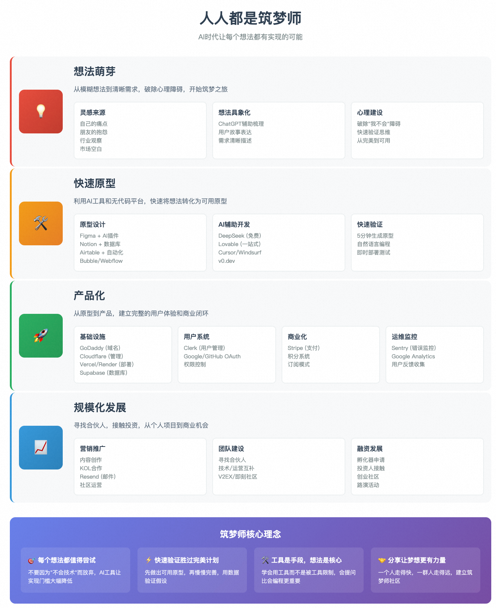
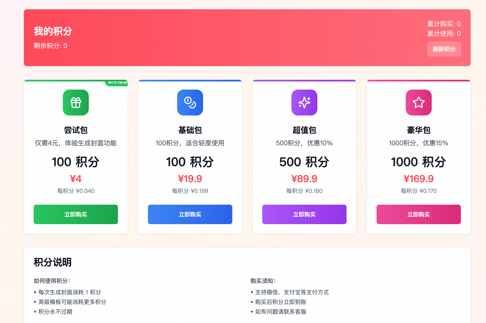
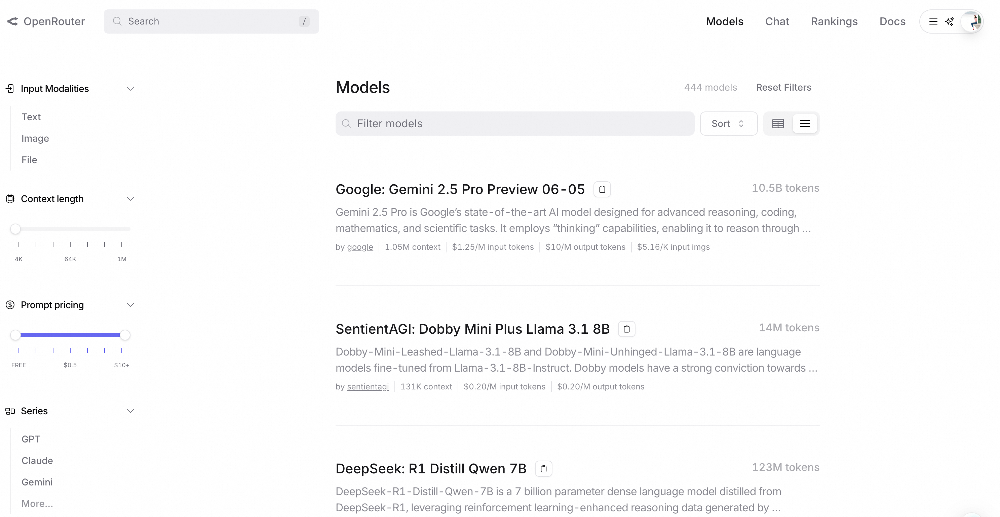

1、从产品经理到筑梦师的演进

过去十年，"人人都是产品经理"理念深入人心。我们学会了用产品思维从用户角度发现问题、定义需求、设计解决方案。

但有一个关键瓶颈始终存在：有了想法之后呢？大多数人在技术实现这一步就止步了。

**当你已经能提出好想法、发现真实需求之后，究竟有多少人能把想法真正落地实现？**

2、一个有趣的现象观察

最近我注意到一些变化：

- 部门大老板、集团高P开始动手编程
- 产品经理们开始"vibe coding"
- 非技术背景的人在尝试自己实现想法

这背后反映了什么？

3、时代转折点的到来

AI工具的普及带来了根本性改变：

- 不仅降低了认知门槛
- 更重要的是大幅降低了实现门槛

以前需要专业开发团队几个月完成的功能，现在一个有想法的人可能几天就能搭建出原型。当然从原型到真正的商业产品还需要一些步骤，可能需要一定技术背景，但验证想法的门槛已经大大降低了。

4、"筑梦师"概念的诞生

前段时间和《人人都是产品经理》作者苏杰老师聊天，我提到现在"人人都是开发者"，建议再出新书。苏杰老师给出了一个更精准的概念：**人人都是筑梦师**。

如果说产品经理是发现和定义问题的人，那么筑梦师就是既能发现问题，又能动手解决问题的人。他们不一定是专业开发者，但有能力将想法转化为可触摸的现实。

思考一个问题：你有多少好想法因为"不会技术"而只能停留在脑海里？如果技术门槛不再是阻碍，你最想实现什么？

今天想分享的是：在发现好想法后，如何落地自己的AI创意？这个过程可能需要哪些东西？

## 一、从想法萌芽到行动准备

### 1.1 想法从哪里来？

首先简单说说灵感来源，因为没有想法就谈不上实现：

**灵感收集的三个渠道：**

- **自己的痛点**：你每天遇到的小麻烦，往往是最好的产品机会
- **身边人的抱怨**：朋友、同事经常吐槽的事情，可能就是市场需求
- **行业观察**：关注你所在领域的效率瓶颈和重复劳动；

每个人都能解决自己遇到的问题。你不需要发明颠覆世界的创意，解决一个具体的小问题就足够了。

- 自动爬取快速增长的数据和趋势
- 多看广告库（Facebook、TikTok都有），广告猛的说明赚钱猛
- 从自己的需求出发，解决自己的问题后推向市场
- 看大站的子页面功能，拆分出来做单一功能
- 找小红书的高赞经验帖子看能否转换为产品
- 看看市面上已经验证过的产品，复制一份.

### 1.2 破除心理障碍

有了想法后，可以考虑培养的几个能力：

- **想法具象化，**从模糊的"这个体验不好"到清晰的"用户在什么场景下需要什么功能"，学会用"用户故事"方式表达：作为XX用户，我希望能够XX，以便于XX；工具推荐：用ChatGPT帮你梳理和完善想法逻辑
- **快速验证**：不需要成为技术专家，使用现有的工具，从"完美主义"转向"快速试错"，用最小成本验证想法的可行性； 另外可能需要稍微具备一些数据思维，慢慢的从凭感觉到基于数据吧。
- **破除"我不会XXX"的心理障碍**

- "我不会编程" → AI可以帮你写代码和调试
- "我不懂设计" → AI可以生成界面和视觉方案
- "我不会运营" → AI可以制定推广策略
- "我没有资源" → 云服务让启动成本降到几十元

从"我不会"到"我可以学XXX"，从关注"技术实现细节"到专注"需求表达清晰"，从追求"完美产品"到先做出"可用原型"

### **1.3 让想法落地的"军火库"**

市面上已经有丰富的工具生态，不管是各种情况都能帮助你快速的解决一下问题：

| **阶段**                             | **产品**                           | **作用**                       |
| ------------------------------------ | ---------------------------------- | ------------------------------ |
| **想法原型化**                       | Figma + AI插件                     | 快速设计产品原型和界面         |
| Notion + 数据库                      | 构建简单的数据管理和协作系统       |                                |
| Airtable + 自动化                    | 无代码数据库应用，适合业务流程管理 |                                |
| Bubble/Webflow                       | 可视化网站和应用构建，拖拽式开发   |                                |
| Typeform                             | 用户调研和反馈收集                 |                                |
| **AI辅助开发**                       | Cursor/Augment/Windsurf            | AI写代码助手，大幅提升开发效率 |
| v0.dev                               | 从自然语言描述直接生成React组件    |                                |
| Claude/ChatGPT                       | 代码生成、调试和优化的全能助手     |                                |
| Replit                               | 在线编程环境，无需本地配置         |                                |
| **商业化部署**                       | Godaddy                            | 域名注册和管理                 |
| 百度统计、Google统计                 | 网站访问数据监控分析               |                                |
| Cloudflare                           | 网站管理、CDN和安全防护            |                                |
| Firebase、Clerk                      | 用户注册、登录和管理系统           |                                |
| Supabase                             | 数据库和文件存储服务               |                                |
| Resend                               | 邮件发送服务                       |                                |
| Sentry                               | 错误监控和问题追踪                 |                                |
| Openrouter、硅基流动                 | 大模型API调用服务                  |                                |
| Stripe、支付宝、微信                 | 在线支付和收费系统                 |                                |
| Vercel、GitHub Pages、Render、Heroku | 应用部署和托管平台                 |                                |

产品太多，个人精简一下：另外产品原型、辅助开发我觉得走的也比较顺了，真正的服务集成... 落地成商业产品部分是我今天想重点分享的内容。

## 二、从原型到产品，让更多人用起来

### 2.1 快速搭建自己的产品原型

当我们有了清晰的想法，下一步并不是直接投入所有资源去开发一个完整的产品。

需要一个低成本、高效率的方式来验证和展示我们的想法——这就是"产品原型";

**原型不是什么？**

- **它不是最终产品**：它可能没有真实的数据，界面可能不精美，性能可能不完善。
- **它不是一成不变的**：它天生就是用来被修改、被迭代，甚至被推翻的。

理解这一点，放下对“完美”的执念，专注于原型最核心的价值——**快速验证与学习**。”聚焦核心流程、速度大于完美；

**如何快速搭建产品原型？**

产品或者设计可能喜欢用Figma做自己的原型，但个人还是开发者，根据自己的选择对交互的重视度选择是否要对应的工具，我这里还是让模型自己发挥；

另外一点，这几个快速是建立在没有任何依赖，直接就可以看到效果的方式，Cursor、Windsurf等虽然强大，但是毕竟还是有点依赖，先用web版现成的工具看看效果；

**首选DeepSeek；Claude4-Ops和Lovable表现也还行；但是DeepSeek是免费的，另外个人感觉审美也是在线的；** 

**但是Lovable的好处是可以帮你直接部署；以及数据库一套东西帮你搞定；**

问法一般是：帮你写个HTML页面，功能描述，用户的输入是什么，可以得到什么输出；

| **产品**       | **效果**                                                     |
| -------------- | ------------------------------------------------------------ |
| DeepSeek       |  |
| lovable        |  |
| v0.dev         | 不及格，没做出来... 刷新之后弹出来，但是看起来效果有点差； |
| claude4-sonnet |  |

如果继续使用Lovable还可以做的事情：非常完整了。**只能说牛逼；**

| 步骤                             | 效果                                                         |
| -------------------------------- | ------------------------------------------------------------ |
| 链接Supabase                     |  |
| 添加用户管理                     |  |
| 增加登录方式                     | 试试Github的配置： |
| 增加支付功能                     | 需要注册Stripe：积分也能展示； |
| 如果还有其他的问题，增加联系方式 |  |

### 2.2 如何运维你的产品-(越来越专业)

其实用Lovable上一步走通基本上没有太大的问题了，这里开始讨论继续迭代吧，第一步建立产品原型与反馈其实是够的。

但是现在还是考虑到更灵活？以及遇到的问题可以解决，可以自定义的内容更多，想要添加更多功能的时候，发现还是要专业开发者介入；

#### 2.2.1 买个域名-Godaddy

数字世界，为了让别人轻松找到你，你需要一个容易记住的域名，比如taobao.com，jd.com，baidu.com这种。

选域名的时候注意：简短易记、与产品相关、不要使用连字符和数字(除非数字本身是品牌的一部分)；

个人购买的域名列表：

|  |  |
| ------------------------------------------------------------ | ------------------------------------------------------------ |
|                                                              |                                                              |

购买位置：

| 特性 / 对比项 | 国内 ( 阿里云, 腾讯云)                                       | 国外 (GoDaddy, Namecheap)                           |
| ------------- | ------------------------------------------------------------ | --------------------------------------------------- |
| 核心要求      | 域名指向中国内地服务器**必须完成 ICP备案****慢 (1-3周)** 需要等待备案审核通过后网站才能上线。 | **无需备案**，购买后可立即解析使用 (服务器需在海外) |
| 优点          | 服务器在内地，体验好一点；                                   | 便捷、全球通用                                      |
| 缺点          | **流程复杂耗时**：备案需要提交多种资料，流程繁琐。**内容限制**：个人备案网站内容受限较多。**缺乏灵活性**：不备案则无法使用内地服务器。 | 访问速度稍慢一点                                    |
| 一句话总结    | 合规、稳定，为服务国内用户铺平道路，但牺牲了速度和灵活性。   | 快速、自由，是启动全球化项目和快速验证想法的首选。  |

**如果是为了快速验证，以及目标用户是全球，可以直接购买国外的域名； AI产品本身现在在速度上要求也没有那么高。** 

分享一个非常朴素但极其有效的决策原则：**当你对一个领域不够了解时，选择那个最知名、市场份额最大的品牌，大概率不会错。**

**GoDaddy是全球最大的域名注册商，对于新手来说，跟随大多数人的选择，可以有效避免“踩坑”。**

#### 2.2.2 管理域名-Cloudfare

当我们拥有了域名，并把它指向了我们的产品原型后，一个‘裸奔’的网站就诞生了。它能被访问，但它很脆弱，速度可能不快，也不够安全。

对于任何一个想要长期运营的网站，无论大小，Cloudflare都应该成为你的标配。它就像一个全能的瑞士军刀，能以极低甚至零成本，极大地提升你网站的性能、安全性和管理效率。

- 全球CDN加速、快速免费HTTPS、免费的网站统计好分析、基础的安全网站防护；

如何配置：**其实就是把域名服务器换成Cloudfare提供的域名服务器。**

- 在你新增加一个Cloudfare运动额时候，会让你在购买域名的地方配置这两个东西；

| 阿里云                                                       | Godaddy                                                      |
| ------------------------------------------------------------ | ------------------------------------------------------------ |
|  |  |

把刚才我们的产品原型，在Lovable上学习配置下：

然后开启下用户分析；

后面方便查看网站浏览，用户等情况；

#### 2.2.4 日常维护-Cursor、Github、Sentry

当第一版验证通过后，进入持续迭代阶段会遇到以下场景：Lovable平台限制：某些复杂调试或批量操作在Lovable上难以完成。

比如这种编译错误：

那么接下来基本上需要做的事情：

- **需要本地开发环境**：进行更精细的代码调试和性能优化
- **生产环境监控**：需要实时了解用户使用情况和错误信息
- **更灵活的部署：从Lovable迁移到更灵活的部署平台** 

这个时候要准备的工具：

| 工具类型 | 工具列表                                                     | 下载地址                                                     |
| -------- | ------------------------------------------------------------ | ------------------------------------------------------------ |
| 开发工具 | **Git**：版本控制基础工具**GitHub CLI (gh)**：快速操作GitHub仓库，创建PR、管理issues**Cursor**：AI辅助的本地代码编辑器，处理Lovable无法解决的问题 | https://github.com/git-guides/install-githttps://cli.github.com/ |
| 部署工具 | **Vercel CLI**：部署Next.js等前端项目的首选**Supabase CLI**：管理数据库迁移、环境变量、本地开发**Cloudflare CLI (Wrangler)**：管理Workers、Pages等边缘计算服务 | https://vercel.com/docs/clihttps://supabase.com/docs/guides/local-development/cli/getting-startedhttps://developers.cloudflare.com/cloudflare-one/tutorials/cli/ |
| 监控工具 | **Sentry**：错误追踪和性能监控**Analytics工具**：Google Analytics、Vercel Analytics等 | https://sentry.io/ https://console.firebase.google.com/  |

#### 2.2.5 做点营销-邮件KOL

- 成为内容的创造者 ：通过创造有价值的内容去主动吸引他们，图文、笔记、博客、公众号；
- 融入社区，建立社区：去你的目标用户聚集的地方，与他们成为朋友，而不是推销员，参与讨论；
- 一些营销邮件：Snov.io 这样的工具来寻找特定领域KOL或潜在客户的联系邮箱，Resend，它提供了一个对开发者友好的API，并且每天有100封的免费发送额度。与少数关键人物建立联系，获取他们的反馈、背书，甚至达成早期合作。

一些分享的经验：

- **避免的坑**：Facebook、TikTok、Google广告不要轻易碰，几百美金很容易打水漂
- **推荐方式**：KOL营销性价比高，100封邮件能有15封看到，谈成1-2个就够了
- KOL合作成本：小KOL可以谈到相对合适的价格，几十美金到100美金，用产品激活码、折扣等方式合作
- 评论区是最好的广告区，在评论区争论，在评论区辅助点赞，人们都认为自己很聪明，有很好的效果；

从公域吸引 (内容)、圈层渗透 (社群) 到 私下链接 (邮件)，构成了一个立体的早期营销矩阵。

以及以上任何一个东西在做的时候，也可以发现问题，提出问题，解决问题，成为产品落地分享，持续过程。

### 2.3 操作FAQ？

#### 如何注册Google Oauth应用

1. 访问 Google Cloud Console`https://console.cloud.google.com/`
2. 创建或选择项目**新项目**：点击顶部项目选择器 → "新建项目" → 输入项目名称**现有项目**：选择要使用的项目
3. 启用 Google+ API（如需要）`左侧菜单 → API 和服务 → 库 搜索 "Google+ API" → 点击启用`

4. 配置 OAuth 同意屏幕
5. 创建 OAuth 2.0 客户端 ID`左侧菜单 → API 和服务 → 凭据 点击 "创建凭据" → "OAuth 客户端 ID"`

#### 如何注册Github Oauth应用

去Github开发者设置页面：https://github.com/settings/developers

在填写回调地址的时候记得填supabase里面设置的地址；

#### 如何选择合适的大模型？- OpenRouter

去OpenRouter里面有很多模型；使用统一的API接口，访问主流的AI模型。

#### 如何选择合适的多模态模型？生图，生视频？ - Fal.ai

https://fal.ai/models?categories=image-to-video,image-to-image 

#### 如何查看自己的数据？Supabase

在supabase后台可以查看自己数据库里面的数据，直接web版就可以；

#### Edge-Function无法依赖一些重型的库？如PDF解析

如下，在你的函数服务里面发现集成不了一些功能强大的库，那么这个时候可能需要一台服务器；

几种选项：

- 1、使用市面上已经提供好的解析服务；
- 2、购买一台服务器部署对应的功能服务； 如DigitalOcean，Google Cloud；
- 3、使用自己的闲置电脑部署服务，但是通过内网传统，ngrok提供服务；

#### 不能购买海外的API服务，没有海外信用卡？

可以注册一些虚拟信用卡： https://yeka.ai/i/YKGF0JM8 

当然这个主要是只能进行消费；

#### 关于如何注册个人Stripe

看这个链接：https://fan-crossborder.com/archives/6530 

### 2.4 体验产品

把这次的功能部署到了这个域名上：

https://xhs.cryptopoint.cc/

包含的功能：

- 功能：生成小红书封面
- 用户登录、支付、积分增加和减少；

## 三、**从个人项目到商业可能**

一个人的精力已经无法满足用户的需求；你可能会看到一个远比最初设想更宏大的市场机会；你可能会开始思考，这个“小而美”的项目，是否有可能成为一番真正的事业？

如果你的答案是肯定的，那么恭喜你，是时候考虑如何让这颗梦想的种子，在一个更专业的生态里发芽、成长了。接下来，我们聊聊如何为你的项目寻求外部的‘阳光雨露’。”

### 3.1 寻找同路人：从“我”到“我们”

一个人的极限，是一个团队的起点。当项目发展到一定阶段，寻找合适的伙伴至关重要。

- **技术合伙人**：如果你是非技术背景，随着产品复杂度的提升，你可能需要一个能深度参与、并主导技术架构的伙伴。
- **运营/市场合伙人**：如果你是技术出身，你可能需要一个擅长与人打交道、能将产品价值传递给更广阔市场的伙伴。
- 去哪里找？

- **你身边的网络**：你的朋友、前同事，是你最了解、最值得信赖的潜在伙伴。
- **线上社区**：V2EX、GitHub、即刻、脉脉等社区，是发现志同道合者的好地方。在分享你的项目时，可以明确表达寻找合伙人的意愿。
- **线下活动**：参加行业会议、技术沙龙、创业路演，主动与人交流。

### 3.2 孵化器与创业社区

孵化器和创业社区不仅提供物理空间，更提供了一个加速成长的生态系统。

- **孵化器 (Incubators) / 加速器 (Accelerators)**

- 它们提供什么？

- **种子资金**：提供一笔启动资金，换取少量股权。
- **导师网络**：对接经验丰富的行业专家和成功企业家，提供一对一指导。
- **资源对接**：提供法律、财务、招聘、媒体曝光等一系列创业公司需要的资源。
- **伙伴社群**：让你和一群同样充满激情的创业者在一起，互相学习、彼此激励。

- 知名代表

- **国际**：Y Combinator (YC), Techstars
- **国内**：奇绩创坛（YC中国前身）、微软加速器、联想之星等。

- **如何申请？** 关注它们的官网，通常每年会有1-2次的申请周期。你需要准备好清晰的产品原型、初步的用户数据和商业计划。

- **线下/线上创业社区**

- **它们是什么？** 这是一个更松散但同样有价值的生态。比如一些联合办公空间举办的创业活动、一些投资机构组织的分享会、或是一些纯线上的创业者社群。
- **价值所在**：在这里，你可以低成本地接触到投资人、潜在伙伴和行业信息，获得宝贵的反馈和机会。

比如：

🔥想一年不如实实在在干两天｜

52小时创业森林 开启报名！

「活动介绍」

结合黑客马拉松的活动形式和精益创业的方法论，从idea到产品发布，52小时内启动一个创业项目。

「活动亮点」

🆓 全程免费，两天食宿全包/软硬件开发资源支持/纪念T恤等

🧑‍🤝‍🧑 陌生组队，一次性遇见100个你完全不认识但都想创业的互补人才

💼 深度辅导，明星创业者/投资人1v1入座辅导，每位半小时起

💡 精益创业：从idea票选做到产品发布，科学运用商业画布等工具

💃 惊喜节目，比赛过程穿插「脱口秀or乐队表演」等派对解压环节

🌟 明星案例，脸萌4个创始人中有3个因此结识并获得idg投资

「社区介绍」

🌲创业森林是由一群来自不同行业/不同职业的组织者，他们工作之余组织52小时创业森林系列活动，共同建设多元有趣的创业者互助社区。

社区slogan是“给改变者力量”。

「报名方式」

👉点击https://senlin.city立即报名

 *为保障选手体验和组队质量，本场活动至多录取100人

🐎欢迎大家提名身边「人才」参与，解锁「伯乐&千里马」特殊羁绊哦

一个周末，和你最想合伙的TA

来一场"试婚式创业"吧！

### 3.3 接触投资人

- 什么时候应该找投资人？

- **时机很重要**：不是越早越好。最好是在你已经拥有清晰的商业模式、验证了产品与市场的匹配度（Product-Market Fit），并且需要资金来扩大市场、招聘团队或进行技术研发时。

- 如何接触投资人？

- **最佳方式：引荐 (Warm Intro)**：通过你的人脉网络（如导师、其他创业者、孵化器）进行介绍，成功率远高于直接发送邮件。
- **冷启动邮件 (Cold Email)**：如果必须如此，确保你的邮件足够精炼、数据亮眼，并能在一分钟内讲清楚你的项目是做什么的、解决了什么问题、市场有多大。
- **积极参与路演活动**：很多投资机构会举办或参加创业路演，这是集中展示自己、接触投资人的好机会。

## 四、总结

在这个AI时代，如何将一个想法，变成一个真实的产品。这是“人人都是筑梦师”，**丰富好用的工具，足以构建任何创意的雏形。**还有长期沉浸在单一的工作环境中，我们接触的信息源和思维模式会逐渐固化，亲手打造一个完整的产品，从构思到上线，从技术到运营，虽然过程中免不了要请教他人、踩坑试错，但恰恰是这种跨领域的实践，能让我们跳出原有的认知边界，获得更立体的视角和更鲜活的信息输入。

“从一个人埋头苦干，到组建团队、拥抱社区、接触资本，这是一个让想法“社会化”的过程。

不是每个项目都需要走上这条路。保持“小而美”的独立运营，同样是一种成功。

当你准备好迎接更大的挑战时，有无数的资源和机会在等待着你。。。 

一些工具地址：

- 代码地址：https://github.com/aihes/xiaohongshu-ai-toolkit
- 产品地址：https://xhs.cryptopoint.cc/ 
- git命令行下载(版本管理)：https://github.com/git-guides/install-git
- gh命令行下载(操作Github)：https://cli.github.com/
- vercel命令行(代码部署)： https://vercel.com/docs/cli
- supabase命令行(后端便捷服务)： https://supabase.com/docs/guides/local-development/cli/getting-started
- Cloudfare命令行(域名管理) https://developers.cloudflare.com/cloudflare-one/tutorials/cli/ 

之前建过一个学习研讨群，只停留在“看”和“聊”，容易陷入“懂了但不会用”的情况。

AI技术日新月异，真正的壁垒不是信息差，而是**实践差**。另外一个实践感觉不限于公司吧... 可以加wx群:

从AI的旁观者，成为真正的玩家！

如果过期了个人wx：aihehe0001

