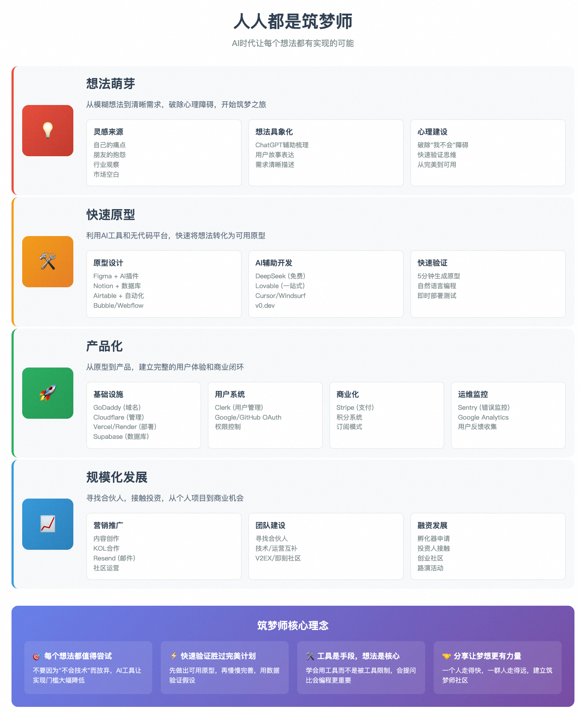

# Markdown图片本地化处理脚本

这个项目包含两个Python脚本，用于处理Markdown文件中的图片，将网络图片下载到本地并更新引用路径。

## 脚本说明

### 1. `download_images.py` - 简化版（推荐）

专门针对"从想法到落地.md"文件设计的简化版脚本。

**功能特点：**
- 🎯 专门处理阿里内网图片链接
- 📁 自动创建`images/`目录
- 🔢 使用序号命名图片文件（image_001_xxx.png）
- 🚀 自动提交到Git并推送到GitHub
- ✅ 简单易用，一键执行

**使用方法：**
```bash
python3 download_images.py
```

### 2. `process_markdown_images.py` - 通用版

功能更全面的通用版本，支持处理任意Markdown文件。

**功能特点：**
- 📄 支持处理任意Markdown文件
- 🌐 支持各种网络图片URL
- 🔄 智能重试机制
- 📊 详细的处理统计
- ⚙️ 可配置的参数

**使用方法：**
```bash
# 处理默认文件
python3 process_markdown_images.py

# 处理指定文件
python3 process_markdown_images.py your_file.md
```

## 执行结果

### 成功处理的内容

✅ **成功下载：** 45个图片  
✅ **失败：** 0个图片  
✅ **图片保存位置：** `images/` 目录  
✅ **文件更新：** `从想法到落地.md`  

### 图片文件命名规则

```
images/
├── image_001_6c9eec6a.png  # 第1个图片
├── image_002_6e3aeded.png  # 第2个图片
├── image_003_99ee08e2.png  # 第3个图片
└── ...
```

命名格式：`image_{序号}_{URL哈希}.png`

### Markdown引用更新

**更新前：**
```markdown

```

**更新后：**
```markdown

```

## Git操作

脚本会自动执行以下Git操作：

1. **添加文件到Git：**
   ```bash
   git add 从想法到落地.md
   git add images/
   ```

2. **提交更改：**
   ```bash
   git commit -m "更新文档：下载图片到本地并更新引用路径"
   ```

3. **推送到GitHub：**
   ```bash
   git push
   ```

## 依赖要求

确保安装了以下Python包：

```bash
pip install requests
```

## 注意事项

⚠️ **重要提醒：**

1. **网络连接：** 确保网络连接稳定，脚本需要下载网络图片
2. **Git配置：** 确保已配置Git用户信息和远程仓库
3. **文件备份：** 建议在运行脚本前备份原始文件
4. **权限检查：** 确保有写入`images/`目录的权限

## 错误处理

脚本包含以下错误处理机制：

- 🔄 **自动重试：** 下载失败时自动重试
- ⏱️ **超时控制：** 30秒下载超时
- 📝 **详细日志：** 显示每个图片的下载状态
- 🛡️ **异常捕获：** 优雅处理各种异常情况

## 使用场景

这个脚本特别适用于：

- 📚 技术文档本地化
- 🔄 博客迁移
- 📖 知识库整理
- 🚀 开源项目文档管理

## 示例输出

```
============================================================
Markdown图片本地化处理脚本
============================================================
创建图片目录: images/
找到 45 个图片需要下载
--------------------------------------------------
正在下载第 1 个图片...
URL: https://intranetproxy.alipay.com/skylark/lark/...
✓ 下载成功: image_001_6c9eec6a.png
...
--------------------------------------------------
处理完成!
✓ 成功下载: 45 个图片
✓ 失败: 0 个图片
✓ 图片保存在: images/ 目录
✓ 已更新文件: 从想法到落地.md

============================================================
是否提交更改并推送到GitHub? (y/n): y

开始Git操作...
✓ Git提交成功
✓ 推送到GitHub成功

脚本执行完成!
```

## 贡献

欢迎提交Issue和Pull Request来改进这个脚本！

## 许可证

MIT License
